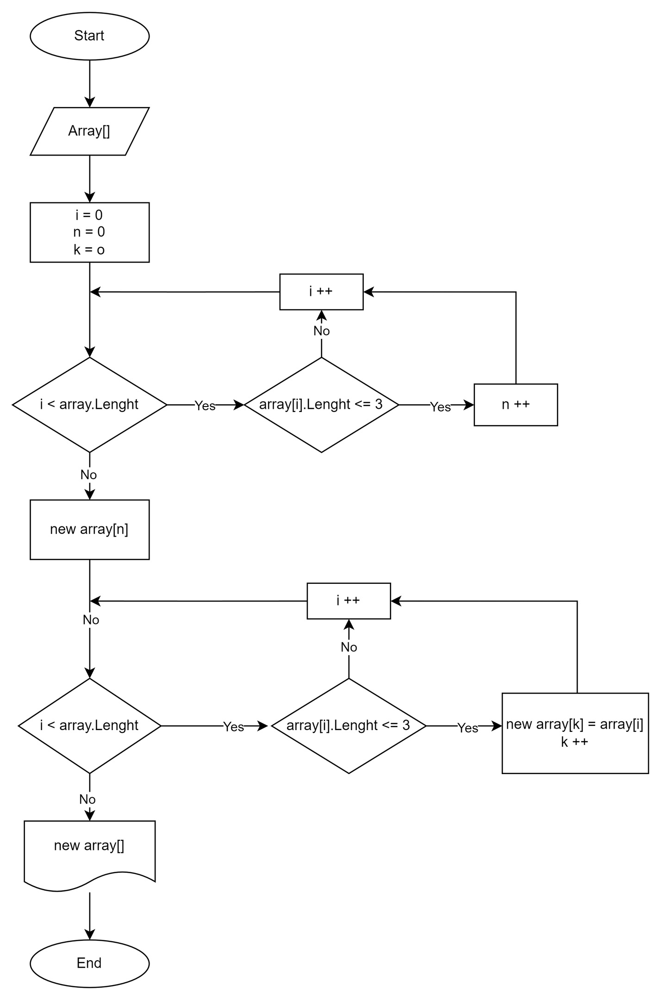

# Итоговая контрольная работа по основному блоку

## Задание

1. Создать репозиторий на GitHub
2. Нарисовать блок-схему алгоритма (можно обойтись блок-схемой основной содержательной части, если вы выделяете её в отдельный метод)
3. Снабдить репозиторий оформленным текстовым описанием решения (файл README.md)
4. Написать программу, решающую поставленную задачу
5. Использовать контроль версий в работе над этим небольшим проектом (не должно быть так, что всё залито одним коммитом, как минимум этапы 2, 3, и 4 должны быть расположены в разных коммитах)

*Задача:* Написать программу, которая из имеющегося массива строк формирует новый массив из строк, длина которых меньше, либо равна 3 символам. Первоначальный массив можно ввести с клавиатуры, либо задать на старте выполнения алгоритма. При решении не рекомендуется пользоваться коллекциями, лучше обойтись исключительно массивами.

*Примеры:*
[“Hello”, “2”, “world”, “:-)”] → [“2”, “:-)”]
[“1234”, “1567”, “-2”, “computer science”] → [“-2”]
[“Russia”, “Denmark”, “Kazan”] → []

## Решение

### Блок-схема алгоритма:

## Описание решения:

1. Создаем функцию FillArray(), которая запрашивает у пользователя размер массива, создает массив заданного размера, заполняет его элементами, введенными пользователем, и возвращает этот массив.

2. Создаем функцию PrintArray(string[] array), которая печатает массив строк в консоль.

3. Создаем функцию ResultArray(string[] array), которая формирует новый массив строк из имеющегося массива, где элементы имеют длину <= 3 символа.